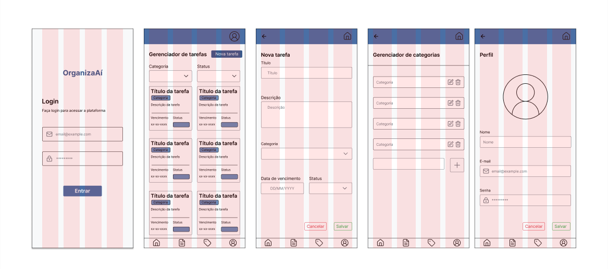

# Web Application Document - Projeto Individual - Módulo 2 - Inteli

**_Os trechos em itálico servem apenas como guia para o preenchimento da seção. Por esse motivo, não devem fazer parte da documentação final._**

## Nome do Projeto

OrganizaAí

#### Autor do projeto

Ana Júlia Rodrigues Ribeiro

## Sumário

1. [Introdução](#c1)  
2. [Visão Geral da Aplicação Web](#c2)  
3. [Projeto Técnico da Aplicação Web](#c3)  
4. [Desenvolvimento da Aplicação Web](#c4)  
5. [Referências](#c5)  

<br>

## <a name="c1"></a>1. Introdução (Semana 01)

&emsp; Atualmente, muitos profissionais enfrentam dificuldades em organizar suas atividades diárias de maneira eficiente, especialmente quando lidam com múltiplos projetos, prazos apertados e equipes diversas. Métodos tradicionais, como anotações em papel, planilhas manuais ou aplicativos não integrados, acabam gerando desorganização, perda de informações importantes e retrabalho constante.

&emsp; Usuários como Laura Martins, Felipe Andrade, Patrícia Souza, Ricardo Lima e Camila Ribeiro relatam que a falta de uma ferramenta prática e centralizada dificulta a gestão de suas rotinas e impacta diretamente na produtividade e na qualidade das entregas.

&emsp; Pensando nessas necessidades, será desenvolvida uma aplicação web focada na organização e gerenciamento de tarefas. A proposta é oferecer uma plataforma intuitiva, que permita o planejamento de atividades, acompanhamento de prazos, categorização de tarefas e colaboração em equipe, promovendo mais controle, eficiência e equilíbrio no dia a dia dos usuários.


---

## <a name="c2"></a>2. Visão Geral da Aplicação Web

### 2.1. Personas (Semana 01)
&emsp; As personas são representações fictícias dos usuários finais do sistema, criadas a partir de dados reais e observações. Elas são essenciais para guiar o desenvolvimento de soluções que atendam às necessidades, objetivos e comportamentos dos usuários. Neste projeto, foram desenvolvidas personas com base em perfis de profissionais que buscam aumentar sua produtividade e organização por meio de ferramentas digitais. O objetivo é entender suas dificuldades, necessidades e preferências no gerenciamento de tarefas diárias, de modo a criar um sistema que ofereça funcionalidades eficientes e intuitivas. Essas personas servirão de base para o desenvolvimento de um gerenciador de tarefas que resolva os principais desafios enfrentados pelos usuários. 


<div style="text-align: center;">
    
    <br>
    <sub>Figura 1 - Persona 1</sub>
    <br>
    <sup>Fonte: Ana Ribeiro, Faculdade Inteli 2025</sup>
</div>


<div style="text-align: center;">
    
    <br>
    <sub>Figura 2 - Persona 2</sub>
    <br>
    <sup>Fonte: Ana Ribeiro, Faculdade Inteli 2025</sup>
</div>


<div style="text-align: center;">
    
    <br>
    <sub>Figura 3 - Persona 3</sub>
    <br>
    <sup>Fonte: Ana Ribeiro, Faculdade Inteli 2025</sup>
</div>


### 2.2. User Stories (Semana 01)
&emsp; As User Stories são uma técnica ágil utilizada para descrever funcionalidades do sistema a partir da perspectiva do usuário. Elas são essenciais para garantir que as soluções atendam às reais necessidades dos usuários e para orientar o time de desenvolvimento nas entregas de valor. Neste projeto, foram criadas User Stories para representar funcionalidades-chave que visam facilitar o gerenciamento de tarefas, promovendo mais organização, produtividade e eficiência no dia a dia dos profissionais. Essas histórias guiarão a implementação de ferramentas que atendem aos desafios identificados nas personas.

#### US01 - Cláudia Tavares
Como engenheira civil, quero uma ferramenta que me ajude a organizar e categorizar minhas tarefas de forma clara, para que eu consiga gerenciar meus projetos de maneira eficiente e sem me sobrecarregar.

#### US02 - Marcelo Antunes
Como engenheiro civil, quero um sistema que permita priorizar tarefas com base em níveis de urgência e importância, para que eu possa focar no que realmente é essencial e entregar melhores resultados.

#### US03 - Beatriz Lemos
Como engenheira de manutenção, quero uma plataforma rápida e prática para criar e acompanhar tarefas, para que eu possa otimizar meu tempo e me concentrar no trabalho em campo sem complicações.

&emsp; Após definir as User Stories, é fundamental analisar cada uma delas sob a ótica do modelo INVEST. Essa abordagem ajuda a garantir que as histórias sejam bem estruturadas, viáveis e entreguem valor ao usuário de forma eficaz. O modelo INVEST — que significa Independente, Negociável, Valiosa, Estimável, Pequena e Testável — oferece critérios claros para validar a qualidade de cada User Story, assegurando que sejam funcionais, fáceis de desenvolver e testáveis. A seguir, será realizada uma análise detalhada de uma das User Stories com base nesses critérios.

#### I – Independente
A User Story **US01** é independente, pois não depende de outras funcionalidades ou User Stories para ser desenvolvida. Ela descreve uma funcionalidade autossuficiente de organização e categorização de tarefas, podendo ser implementada de forma isolada.

#### N – Negociável
A funcionalidade descrita é negociável. O comportamento desejado — organizar e categorizar tarefas — pode ser discutido e ajustado conforme as necessidades do usuário ou do desenvolvimento do sistema, permitindo flexibilidade nas soluções.

#### V – Valiosa
Essa User Story é valiosa para o usuário, pois atende diretamente a uma necessidade de **Cláudia**: ter suas tarefas organizadas de maneira clara e eficiente, reduzindo a sobrecarga de trabalho e aumentando sua produtividade.

#### E – Estimável
A User Story é estimável, pois é possível calcular o esforço necessário para criar a funcionalidade. As ações de categorizar e organizar tarefas são claras e mensuráveis, permitindo uma estimativa razoável de tempo e recursos.

#### S – Pequena (Small)
A User Story é pequena o suficiente para ser concluída em um ciclo de desenvolvimento. Ela pode ser dividida em subtarefas como criação de categorias, adição de tarefas e visualização organizada, facilitando o processo de entrega.

#### T – Testável
A User Story é testável, pois é possível verificar se as tarefas estão sendo corretamente organizadas e categorizadas no sistema. Os testes podem simular diferentes fluxos de criação e organização de tarefas para validar a funcionalidade.


---

## <a name="c3"></a>3. Projeto da Aplicação Web

### 3.1. Modelagem do banco de dados  (Semana 3)
&emsp; Para que o sistema funcione de forma ágil e confiável, gerenciando usuários, tarefas e suas categorias, é essencial contar com uma estrutura de dados bem definida. Por isso, a escolha de um banco de dados relacional é fundamental, pois garante a integridade, a organização e o acesso rápido às informações que sustentam o OrganizaAí.
&emsp; A partir disso, segue abaixo o Diagrama Entidade-Relacionamento que mostra a estrutura completa do banco de dados, com todas as tabelas e suas relações. 


<div style="text-align: center;">
    
    <br>
    <sub>Figura 4 - Modelo Entidade Relacionamento</sub>
    <br>
    <sup>Fonte: Ana Ribeiro, Faculdade Inteli 2025</sup>
</div>

&emsp; Observa-se, portanto, a estrutura das tabelas, seus atributos e os relacionamentos entre elas. A tabela USERS, por exemplo, armazena informações dos usuários, sendo que cada linha representa um usuário com seus respectivos dados. Ela possui um relacionamento do tipo 1:N (um para muitos) com a tabela TASKS, já que um único usuário pode estar associado a várias tarefas. Já a tabela CATEGORIES, que contém um único atributo — o nome da categoria —, também se relaciona com TASKS em uma relação 1:N, pois uma categoria pode classificar diversas tarefas.

&emsp; Abaixo está o esqauema e Banco de Dados do OrganizaAí com as tabelas e suas relações:

#### 1. Users e atribuição de Tasks
***Tabela: ```USERS```***
- Descrição: armazena informações dos usuários
- ```id``` (INT, PK)
- ```name```(VARCHAR)
- ```email```(VARCHAR)
- ```password```(VARCHAR)
- ```created_at```(TIMESTAMP)

***Tabela: ```TASKS```***
- Descrição: armazena informações das tasks
- ```id``` (INT, PK)
- ```title```(VARCHAR)
- ```description```(TEXT)
- ```due_date```(DATE)
- ```status```(VARCHAR)
- ```user_id```(INT)
- ```category_id```(INT, FK)
- ```created_at``` (TIMESTAMP)

***Relacionamento***: Um usuário pode estar vinculado a várias tarefas (relação 1:N com a tabela tasks).

#### 2. Tasks e categorias 

***Tabela: ```TASKS```***
- Descrição: armazena informações das tasks
- ```id``` (INT, PK)
- ```title```(VARCHAR)
- ```description```(TEXT)
- ```due_date```(DATE)
- ```status```(VARCHAR)
- ```user_id```(INT)
- ```category_id```(INT, FK)
- ```created_at``` (TIMESTAMP)

***Tabela: ```CATEGORIES```***
- Descrição: Armazena as categorias utilizadas para classificar as tarefas.
- ```id``` (INT, PK)
- ```name```(VARCHAR)

***Relacionamento***: Uma categoria pode ser associada a várias tarefas (relação 1:N com tasks).

### 3.1.1 BD e Models (Semana 5)
&emsp; Os models são responsáveis por interagir com o banco de dados, facilitando a manipulação dos dados. A seguir, uma descrição dos models implementados:
- ```userModel```: Responsável por gerenciar os dados relacionados aos usuários. Este model executa operações como listar, adicionar, atualizar e remover usuários no banco de dados, sendo diretamente associado à tabela users.
- ```tasksModel```: Manipula os dados das tarefas atribuídas aos usuários. É responsável por criar, listar, atualizar e excluir tarefas, atuando como a camada de acesso à tabela tasks, que centraliza o controle de pendências do sistema.
- ```categoriesModel```: Gerencia as categorias disponíveis para classificação das tarefas. Este model realiza operações de CRUD na tabela categories, sendo essencial para manter a organização e filtragem das tarefas dentro da aplicação.

### 3.2. Arquitetura (Semana 5)
&emsp; O padrão MVC (Model-View-Controller) é uma forma de organizar o código separando a lógica do sistema (Model), a interface com o usuário (View) e o controle das ações (Controller).

- ```Model```: cuida da lógica e acesso aos dados (como banco de dados);
- ```View```: mostra os dados ao usuário (HTML, CSS, etc);
- ```Controller```: liga o usuário ao sistema, controlando o que acontece ao clicar ou enviar dados.

&emsp; Esse padrão facilita a manutenção, a reutilização de código e a separação entre layout e funcionamento.

<div style="text-align: center;">
    
    <br>
    <sub>Figura 5 - Diagrama de arquitetura MVC</sub>
    <br>
    <sup>Fonte: Ana Ribeiro, Faculdade Inteli 2025</sup>
</div>

### Views

Com base nos controllers disponíveis (User, Tasks e Categories) e nas user stories fornecidas, segue a documentação das telas essenciais do sistema:

## Usuário

**1. Tela de Login**

- **Função:** Permite que o usuário acesse o sistema através de suas credenciais (email e senha).

- **Componentes/Inputs Principais:** Formulário com campos para email e senha e botão de login. Utiliza uma estrutura HTML simples com validação de formulário.

- **Conexão com Controllers:** Ao submeter o formulário, o JavaScript envia uma requisição que verifica as credenciais usando o método `getById` do `User` controller para buscar o usuário pelo email e comparar a senha. Se válidas, o usuário é autenticado e redirecionado para o Dashboard.

**2. Dashboard / Lista de Tarefas (Tela Principal)**

- **Função:** Apresenta ao usuário uma visão geral de suas tarefas, permitindo fácil visualização, acesso rápido para criação e modificação, e organização básica. Esta tela atende diretamente às necessidades expressas em US01 (organizar e categorizar), US02 (visualizar para priorizar) e US03 (acompanhar tarefas).

- **Componentes/Inputs Principais:**
    - Lista/Cards exibindo as tarefas do usuário (com título, categoria, data de vencimento, status)
    - Opções de filtro por categoria e status
    - Botão para adicionar uma nova tarefa
    - Links ou botões em cada tarefa para visualizar detalhes, editar ou excluir

- **Conexão com Controllers:** Ao carregar, a View faz uma chamada que aciona o método `getAll` do controller `Tasks` para buscar todas as tarefas. Os filtros podem ser aplicados no frontend ou através de parâmetros adicionais na consulta. Ações de editar/excluir em uma tarefa específica chamam os métodos `update` ou `delete` do controller `Tasks`.

**3. Criar / Editar Tarefa**

- **Função:** Permite que o usuário crie novas tarefas ou modifique tarefas existentes, detalhando informações como título, descrição, categoria, data de vencimento e status. Esta tela é fundamental para atender US01 (categorizar tarefas) e US03 (criar tarefas de forma prática).

- **Componentes/Inputs Principais:**
    - Formulário com campos para título, descrição, categoria (dropdown), data de vencimento (date picker) e status (dropdown)
    - Botões para salvar ou cancelar a operação

- **Conexão com Controllers:** Ao carregar (para o dropdown de categorias), a View chama o método `getAll` do controller `Categories`. Ao submeter o formulário, aciona o método `create` ou `update` do controller `Tasks`, dependendo se é uma nova tarefa ou edição.

**4. Gerenciar Categorias**

- **Função:** Permite ao usuário visualizar, criar, editar e excluir categorias para organização de tarefas, atendendo diretamente à US01 (categorizar tarefas de forma clara).

- **Componentes/Inputs Principais:**
    - Lista de categorias existentes
    - Formulário para adicionar nova categoria (nome)
    - Opções para editar ou excluir categorias existentes

- **Conexão com Controllers:** A View interage com o controller `Categories` através dos métodos `getAll`, `create`, `update` e `delete`. As operações são refletidas no banco de dados e atualizadas na interface.

**5. Perfil do Usuário**

- **Função:** Permite ao usuário visualizar e editar suas informações pessoais.

- **Componentes/Inputs Principais:**
    - Exibição dos dados atuais do usuário
    - Formulário para atualização de nome, email e senha

- **Conexão com Controllers:** A View interage com o controller `User` através dos métodos `getById` para buscar dados do usuário e `update` para atualizar informações. As alterações são validadas, persistidas no banco de dados e refletidas na interface.


## Observações Técnicas

- **Arquitetura MVC:** O sistema segue o padrão MVC (Model-View-Controller) conforme mostrado no diagrama fornecido, com três controllers principais: User, Tasks e Categories.

- **Responsividade:** Todas as telas são responsivas e se adaptam a diferentes tamanhos de tela.

- **Armazenamento:** As operações de CRUD são realizadas através dos controllers que se comunicam com o banco de dados PostgreSQL.

- **Autenticação:** O sistema utiliza autenticação básica para proteger as rotas e garantir que apenas usuários autorizados acessem as funcionalidades.

- **User Stories Atendidas:** 
  - US01: Organização e categorização de tarefas (Dashboard e Gerenciar Categorias)
  - US02: Priorização de tarefas com base em urgência (Dashboard com filtros e status)
  - US03: Plataforma rápida e prática para criar e acompanhar tarefas (Criar/Editar Tarefa e Dashboard)


### 3.3. Wireframes 

<div style="text-align: center;">
    
    <br>
    <sub>Figura 6 - Wireframe</sub>
    <br>
    <sup>Fonte: Ana Ribeiro, Faculdade Inteli 2025</sup>
</div>

### Relação entre Wireframes e User Stories

&emsp; Os wireframes desenvolvidos para o gerenciador de tarefas foram pensados especificamente para atender às necessidades expressas nas três user stories. A tela de Dashboard, com seus cards organizados e filtros por categoria e status, permite que Cláudia (US01) organize visualmente suas tarefas e que Marcelo (US02) identifique rapidamente as prioridades através dos status e datas de vencimento. A interface limpa e direta atende à necessidade de Beatriz (US03) de ter uma plataforma rápida e sem complicações.

&emsp; A tela de Criar/Editar Tarefa, com campos simples e objetivos, possibilita que Cláudia categorize suas atividades, que Marcelo defina prioridades através do status e datas, e que Beatriz crie tarefas de forma ágil sem navegação complexa. Já a tela de Gerenciar Categorias é especialmente valiosa para Cláudia, permitindo personalizar a organização conforme seus projetos evoluem.

&emsp; Em conjunto, estas telas formam uma solução coesa que equilibra organização, priorização e praticidade, respondendo diretamente aos desafios apresentados pelos três usuários em suas histórias.


### 3.4. Guia de estilos (Semana 05)
&emsp; Este guia de estilos apresenta os principais padrões visuais e componentes utilizados no Gerenciador de Tarefas, servindo como referência para manter a consistência visual e a experiência do usuário em toda a aplicação mobile.


### Layout e Grid 
&emsp; O layout da aplicação segue um sistema de grid de 4 colunas, otimizado para dispositivos móveis, com os seguintes padrões:
- Dimensões base: Padrão iPhone 14;

- Margens laterais: 40px para a tela de login e 20px para as demais telas;

- Sistema de espaçamento: 20px entre as colunas;

&emsp; Veja abaixo o sistema de grip aplicado no protótipo: 

<div style="text-align: center;">
    
    <br>
    <sub>Figura 7 - Layout e Grid</sub>
    <br>
    <sup>Fonte: Ana Ribeiro, Faculdade Inteli 2025</sup>
</div>

### Tipografia
&emsp; A família tipográfica principal é a Inter, uma fonte sans-serif moderna e de alta legibilidade em telas pequenas:

<div style="text-align: center;">
    
    <br>
    <sub>Figura 8 - Tipografia</sub>
    <br>
    <sup>Fonte: Ana Ribeiro, Faculdade Inteli 2025</sup>
</div>

### Paleta de Cores
&emsp; A paleta de cores foi cuidadosamente selecionada para garantir contraste adequado e hierarquia visual clara:

<div style="text-align: center;">
    
    <br>
    <sub>Figura 9 - Paleta de Cores</sub>
    <br>
    <sup>Fonte: Ana Ribeiro, Faculdade Inteli 2025</sup>
</div>

&emsp; A paleta de cores foi selecionada para criar uma identidade visual coesa e funcional. Os tons de azul estabelecem a personalidade do aplicativo, enquanto as cores secundárias (verde, amarelo e vermelho) cumprem funções semânticas essenciais: sucesso, alerta e erro, respectivamente. A escala de cinzas complementa o sistema, criando hierarquia visual para textos e elementos secundários. Este conjunto de cores não apenas embeleza a interface, mas também apoia a usabilidade e acessibilidade, garantindo contraste adequado e significado visual consistente em toda a aplicação.

### Botões
&emsp; Os botões seguem um padrão consistente com diferentes estados e variações:

<div style="text-align: center;">
    
    <br>
    <sub>Figura 10 - Botões</sub>
    <br>
    <sup>Fonte: Ana Ribeiro, Faculdade Inteli 2025</sup>
</div>

&emsp; Veja que cada botão tem 4 variantes, sendo uma no estado Normal, uma em Hover, uma Pressionada e uma Desabilitada, suas configurações são: 

- Normal: Opacidade 100%;
- Hover: Escurecido em 10%;
- Pressionado: Escurecido em 15%;
- Desabilitado: Opacidade 50%.

### Campos de Formulário
&emsp; Os campos de formulário são projetados para facilitar a entrada de dados em dispositivos móveis:

<div style="text-align: center;">
    
    <br>
    <sub>Figura 11 - Botões</sub>
    <br>
    <sup>Fonte: Ana Ribeiro, Faculdade Inteli 2025</sup>
</div>

&emsp; Os campos de formulário apresentados acima foram cuidadosamente projetados para proporcionar uma experiência de usuário intuitiva e eficiente. Cada elemento segue rigorosamente o guia de estilos estabelecido, garantindo consistência visual e funcional em toda a aplicação.

&emsp; Os inputs de texto para título e nome mantêm uma estrutura limpa com rótulos claros, enquanto as áreas de descrição oferecem espaço adequado para conteúdo mais extenso. Os dropdowns para categorias e status apresentam estados fechados e abertos bem definidos, facilitando a seleção de opções pelo usuário. Os campos de data foram formatados para entrada padronizada, e os campos de email e senha incluem ícones indicativos que melhoram a compreensão imediata de sua função.

&emsp; Esta biblioteca de componentes de formulário não apenas atende às necessidades funcionais do gerenciador de tarefas, mas também contribui para uma experiência visual coesa e profissional, refletindo o cuidado com os detalhes de interação que são essenciais para aplicações mobile de alta qualidade.

### Ícones e Assets
&emsp; O sistema utiliza ícones da biblioteca Font Awesome para garantir boa visibilidade em telas touch:

<div style="text-align: center;">
    
    <br>
    <sub>Figura 12 - Iconografia</sub>
    <br>
    <sup>Fonte: Ana Ribeiro, Faculdade Inteli 2025</sup>
</div>

### 3.5. Protótipo de alta fidelidade (Semana 05)
&emsp; O protótipo de alta fidelidade do Gerenciador de Tarefas foi desenvolvido seguindo o guia de estilos apresentado anteriormente, transformando os wireframes em uma interface visual completa e refinada. Abaixo estão as principais telas do sistema, organizadas na ordem de uso.

#### Tela de Login

<div style="text-align: center;">
    
    <br>
    <sub>Figura 13 - Tela de login</sub>
    <br>
    <sup>Fonte: Ana Ribeiro, Faculdade Inteli 2025</sup>
</div>
&emsp; A tela de login apresenta uma interface limpa e direta, com campos para email e senha, seguindo a paleta de cores principal do sistema.

#### Tela de home

<div style="text-align: center;">
    
    <br>
    <sub>Figura 14 - Tela de home</sub>
    <br>
    <sup>Fonte: Ana Ribeiro, Faculdade Inteli 2025</sup>
</div>
&emsp; A home é a tela principal do aplicativo, exibindo as tarefas do usuário organizadas em cards, com filtros por categoria e status, e um botão de destaque para adicionar novas tarefas.

#### Tela de adicionar tarefa

<div style="text-align: center;">
    
    <br>
    <sub>Figura 15 - Tela de adicionar tarefa</sub>
    <br>
    <sup>Fonte: Ana Ribeiro, Faculdade Inteli 2025</sup>
</div>
&emsp; Este modal permite ao usuário adicionar ou modificar tarefas, com campos para título, descrição, categoria, data de vencimento e status.

#### Tela de adicionar categoria

<div style="text-align: center;">
    
    <br>
    <sub>Figura 16 - Tela de adicionar categoria</sub>
    <br>
    <sup>Fonte: Ana Ribeiro, Faculdade Inteli 2025</sup>
</div>
&emsp; O modal de categorias permite ao usuário visualizar, adicionar, editar e excluir categorias para organização das tarefas.

#### Tela de perfil

<div style="text-align: center;">
    
    <br>
    <sub>Figura 17 - Tela de Perfil</sub>
    <br>
    <sup>Fonte: Ana Ribeiro, Faculdade Inteli 2025</sup>
</div>
&emsp; Este modal permite ao usuário visualizar e editar suas informações pessoais, como nome, email e senha.

#### Fluxo de navegação
&emsp; O protótipo foi projetado para oferecer uma navegação intuitiva entre as telas:
1. O usuário inicia na tela de login

2. Após autenticação, é direcionado ao dashboard

3. Do dashboard, pode acessar:

- Modal de criar tarefa (botão "Nova Tarefa")

- Modal de editar tarefa (botão de edição nos cards)

- Modal de gerenciar categorias (via menu)

- Modal de perfil do usuário (via menu)


#### Relação com User Stories
&emsp; O protótipo atende diretamente às necessidades expressas nas user stories:

- Para Cláudia (US01): O sistema de categorias coloridas e a organização visual clara permitem gerenciar tarefas de forma eficiente

- Para Marcelo (US02): Os indicadores de status e datas de vencimento facilitam a priorização de tarefas

- Para Beatriz (US03): A interface simplificada e direta permite criar e acompanhar tarefas rapidamente

&emsp; Link para o Protótipo Completo: 
 [Gerenciador de Tarefas - Protótipo Figma](https://www.figma.com/design/nv5f7IA5JDPXFmgR2kKwus/wireframe_projetopessoal?node-id=26-849&t=ir3KwAfZNQ0TVb0R-1)

&emsp; Este protótipo representa a visão final da interface do Gerenciador de Tarefas, pronta para implementação, mantendo fidelidade às user stories e wireframes desenvolvidos anteriormente, com refinamentos visuais que melhoram a experiência do usuário.


### 3.6. WebAPI e endpoints (Semana 05)
&emsp; As Web APIs desempenham um papel essencial na conexão entre diferentes sistemas, permitindo que aplicações distintas troquem informações de maneira organizada. Utilizando os chamados endpoints — que funcionam como portas de entrada para os recursos da API — é possível realizar ações como buscar, enviar e modificar dados. Esse tipo de integração facilita o reaproveitamento de funcionalidades, amplia a capacidade dos sistemas e torna o desenvolvimento de soluções digitais mais ágil. Por isso, APIs e seus endpoints são peças-chave na criação de ambientes tecnológicos bem integrados e eficientes.

#### USERS
&emsp; Gerenciamento de informações dos usuários do sistema.

#### Listar todos os usuários:
- URL: ```api/users```
- MÉTODO: ```GET```
- RESPOSTA: 
    ```json
    {
        "id": 12,
        "name": "Maria",
        "email": "aninhamary@example.com",
        "password": "123456",
        "created_at": "2025-05-30T06:02:20.444Z"
    },
    {
        "id": 13,
        "name": "Mateus",
        "email": "mateus@example.com",
        "password": "123456",
        "created_at": "2025-05-30T06:05:04.851Z"
    },
    {
        "id": 8,
        "name": "Novo nome",
        "email": "novoemail@example.com",
        "password": "novasenha",
        "created_at": "2025-05-30T01:58:50.172Z"
    } 


#### Selecionar por id
- URL: ```api/users/:id```
- MÉTODO: ```GET```
- RESPOSTA: 
    ```json
    {
    "id": 12,
    "name": "Maria",
    "email": "aninhamary@example.com",
    "password": "123456",
    "created_at": "2025-05-30T06:02:20.444Z"
    }

#### Adicionar um usuário
- URL: ```api/users```
- MÉTODO: ```POST```
- BODY: 
    ```json
    {
  "name": "Ana Julia",
  "email": "aninhagamer@example.com",
  "password": "senhaSegura123"
    }
- RESPOSTA: 
    ```json
    {
    "id": 14,
    "name": "Ana Julia",
    "email": "aninhagamer@example.com",
    "password": "senhaSegura123",
    "created_at": "2025-05-30T07:50:56.252Z"
    }

#### Atualizar informações de um usuário
- URL: ```api/users/:id```
- MÉTODO: ```PUT```
- BODY:
```json
    {
    "name": "Ana Julia",
    "email": "aninhagamer123@example.com",
    "password": "senhaSegura123"
    }
    
```
    

- RESPOSTA:
```json
    {
    "id": 14,
    "name": "Ana Julia",
    "email": "aninhagamer123@example.com",
    "password": "senhaSegura123",
    "created_at": "2025-05-30T07:50:56.252Z"
    }
```
#### Deletar um usuário
- URL: ```api/users/:id```
- MÉTODO: ```DELETE```
- RESPOSTA (204 No Content)


#### TASKS
&emsp; Gerenciamento de informações das tarefas do sistema.

#### Listar todos as tasks:
- URL: ```api/tasks```
- MÉTODO: ```GET```
- RESPOSTA: 
    ```json
    {
        "id": 11,
        "title": "Analisar banco de dados",
        "description": "Verificar se todas as tabelas estão completas",
        "due_date": "2025-06-05T03:00:00.000Z",
        "status": "pendente",
        "user_id": 12,
        "category_id": 2,
        "created_at": "2025-05-30T07:04:24.447Z"
    }


#### Adicionar uma tarefa
- URL: ```api/tasks```
- MÉTODO: ```POST```
- BODY: 
    ```json
    {
        "title": "Revisar documentação técnica",
        "description": "Conferir se os documentos estão atualizados antes da entrega final",
        "due_date": "2025-06-10T03:00:00.000Z",
        "status": "em andamento",
        "user_id": 12,
        "category_id": 2
    }

#### RESPOSTA: 
 ```json
    {
        "id": 12,
        "title": "Revisar documentação técnica",
        "description": "Conferir se os documentos estão atualizados antes da entrega final",
        "due_date": "2025-06-10T03:00:00.000Z",
        "status": "em andamento",
        "user_id": 12,
        "category_id": 2,
        "created_at": "2025-05-30T08:06:42.454Z"
    }
```

#### Atualizar informações de uma tarefa
- URL: ```api/tasks/:id```
- MÉTODO: ```PUT```
- BODY:
```json
    {
        "title": "Revisar documentação técnica",
        "description": "Conferir se os documentos estão atualizados antes da entrega final",
        "due_date": "2025-06-10T03:00:00.000Z",
        "status": "finalizada",
        "user_id": 12,
        "category_id": 2
    }
```
    

- RESPOSTA:
```json
    {
        "id": 12,
        "title": "Revisar documentação técnica",
        "description": "Conferir se os documentos estão atualizados antes da entrega final",
        "due_date": "2025-06-10T03:00:00.000Z",
        "status": "finalizada",
        "user_id": 12,
        "category_id": 2,
        "created_at": "2025-05-30T08:06:42.454Z"
    }
```
#### Deletar um usuário
- URL: ```api/users/:id```
- MÉTODO: ```DELETE```
- RESPOSTA (204 No Content)


#### CATEGORIES
&emsp; Gerenciamento de categorias das tarefas do sistema.

#### Listar todos as categorias:
- URL: ```api/categories```
- MÉTODO: ```GET```
- RESPOSTA: 
    ```json
    {
        "id": 2,
        "name": "Manutenção"
    }
#### Adicionar uma categoria
- URL: ```api/categories```
- MÉTODO: ```POST```
- BODY: 
    ```json
    {
        "name": "Revisão"
    }
- RESPOSTA: 
    ```json
        {
            "id": 4,
            "name": "Revisão"
        }
    ```

#### Atualizar uma categoria
- URL: ```api/categories/:id```
- MÉTODO: ```PUT```
- BODY:
```json
    {
        "name": "Revisão final"
    }
```
    

- RESPOSTA:
```json
    {
        "id": 4,
        "name": "Revisão final"
    }
```
#### Deletar um usuário
- URL: ```api/users/:id```
- MÉTODO: ```DELETE```
- RESPOSTA (204 No Content)


### 3.7 Interface e Navegação (Semana 07)

*Descreva e ilustre aqui o desenvolvimento do frontend do sistema web, explicando brevemente o que foi entregue em termos de código e sistema. Utilize prints de tela para ilustrar.*

---

## <a name="c4"></a>4. Desenvolvimento da Aplicação Web (Semana 8)

### 4.1 Demonstração do Sistema Web (Semana 8)

*VIDEO: Insira o link do vídeo demonstrativo nesta seção*
*Descreva e ilustre aqui o desenvolvimento do sistema web completo, explicando brevemente o que foi entregue em termos de código e sistema. Utilize prints de tela para ilustrar.*

### 4.2 Conclusões e Trabalhos Futuros (Semana 8)

*Indique pontos fortes e pontos a melhorar de maneira geral.*
*Relacione também quaisquer outras ideias que você tenha para melhorias futuras.*


## <a name="c5"></a>5. Referências

_Incluir as principais referências de seu projeto, para que seu parceiro possa consultar caso ele se interessar em aprofundar. Um exemplo de referência de livro e de site:_<br>

---
---